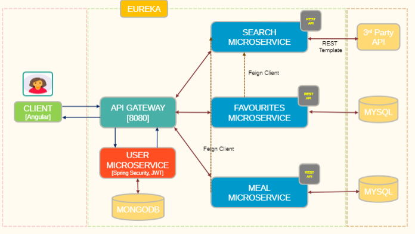

# Nutri Me BackEnd

Nutri Me application  is built with an objective to help users to find nutrition details of food, lose weight, be healthy, and get stronger. There are multiple benefits to utilizing the Nutri Me app, including a calorie counter, BMI tracker and nutrition planning to adopt a healthy diet.

Features of Nutri Me Application:
- Search Food
- Add To Favorites
- Add To Meal
- BMI Tracker
- Analyze Nutrition content of the meal selected

**Microservices**

- DiscoveryService
- GatewayService
- SerachService
- FavouriteService
- MealService
- UserService

**Architecture diagram of the Nutri Me Microservices**

## Starting services locally without Docker

Every microservice is a Spring Boot application and can be started locally using IDE ([Lombok](https://projectlombok.org/) plugin has to be set up) or `mvn spring-boot:run` command. Please note that supporting services (Discovery Server) must be started before any other application (Search, Favourite, Meal and User).
If everything goes well, you can access the following services at given location:
* Discovery Server - http://localhost:8761
* Angular frontend (API Gateway) - http://localhost:8080
* Search, Favourite, Meal and User Services - random port, check Eureka Dashboard

## Starting services locally with docker-compose
In order to start entire infrastructure using Docker, you have to build images by executing `mvn clean install -P buildDocker` 
from a project root. Once images are ready, you can start them with a single command
`docker-compose up`. 
After starting services, it takes a while for API Gateway to be in sync with service registry,You can track services availability using Eureka dashboard http://localhost:8761.

# Tools & Technologies Used 

    Spring Boot V2.6.5
    MySQL Latest
    Angular 8
    Bootstrap 5
    Java 8
    Sppring Cloud 2021.0.1

# 3rd Part API's

The application needs to search for food and find nutrition data for a selected food by registering
with the following link and get API key required to call the APIs.
- https://fdc.nal.usda.gov/api-key-signup.html
- https://fdc.nal.usda.gov/api-guide.html

# Docker Tool

        To viewdocker images - docker images
        To view containers - docker ps -a
        Insepct container - docker inspect <container_id>
        Run the docker docker-compose - docker compose up
        Run the Dockerfile - docker build -t <image_name> . 

